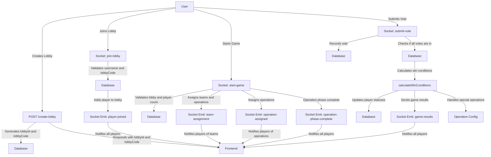

# The basic Flow of the server Transaction

## flowchart

## events and triggers

| Event                   | Type          | Description                                                                                               | Triggers                                                                     |
|-------------------------|---------------|-----------------------------------------------------------------------------------------------------------|------------------------------------------------------------------------------|
| POST /create-lobby      | HTTP Endpoint | Creates a new game lobby with a unique ID and code. Stores the lobby and the first player in the database. | Responds with `lobbyId` and `lobbyCode`.                                     |
| join-lobby              | Socket Event  | Allows a player to join an existing lobby by providing a username and lobby code.                         | Emits `player-joined` to the lobby room or `error` if joining fails.         |
| start-game              | Socket Event  | Starts the game for a lobby. Assigns teams (impostors and agents) and assigns operations to players.       | Emits `team-assignment`, `operation-assigned`, and `operation-phase-complete`.|
| submit-vote             | Socket Event  | Submits a player's vote during the voting phase.                                                          | Emits `vote-submitted` and triggers `calculateWinConditions` if all votes are in. |
| team-assignment         | Socket Emit   | Notifies players of their assigned teams (impostors and agents).                                          | Triggered by `start-game`.                                                   |
| operation-assigned      | Socket Emit   | Notifies a specific player of their assigned operation.                                                   | Triggered by `start-game`.                                                   |
| operation-phase-complete| Socket Emit   | Notifies all players that the operation assignment phase is complete.                                     | Triggered by `start-game`.                                                   |
| vote-submitted          | Socket Emit   | Notifies all players in the lobby that a vote has been submitted.                                         | Triggered by `submit-vote`.                                                  |
| game-results            | Socket Emit   | Sends the final game results to all players in the lobby.                                                 | Triggered by `calculateWinConditions`.                                       |
| error                   | Socket Emit   | Sends an error message to the client.                                                                     | Triggered by any error in socket events like `join-lobby`, `start-game`, etc.|
